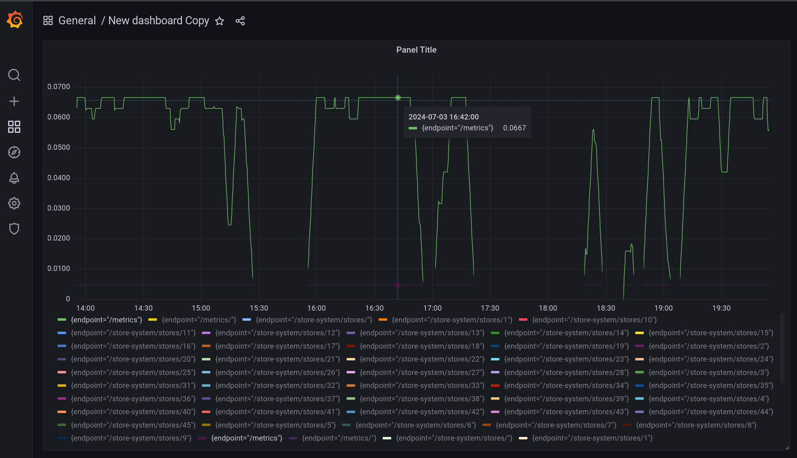

# 파이썬과 postgreSQL 로 db 연습 및 테스트 목적 레퍼지토리

## 프로젝트 개요 

- FastAPI를 사용하여 PostgreSQL 데이터베이스의 성능을 테스트하기 위한 목적으로 구성함
- 병원 시스템, 주차 시스템, 상점 시스템 등 다양한 시나리오를 구현하여 데이터베이스 성능을 측정하고 분석
- ORM 설정 및 relation 을 다양하게 해서 연관관계 설정을 연습

## 구성요소

- Python 3.11
- PostgreSQL 13
- FastAPI 0.78.0
- SQLAlchemy 2.0.0+
- Grafana 8.2.2
- Prometheus 2.30.3
- Docker 및 Docker Compose

## 패키지 매니저 

- poetry

## 프로젝트 구성 

```
alembic/  
app/  
  core/  
  hospital_system/  
  load_tests/  
  parking_system/  
  store_system/  
grafana/  
  dashboards/  
  datasources/  
  provisioning/  
Prometheus/  
scripts/
```

## 주요 기능 [TODO_LIST]

- ✅ FastAPI를 이용한 RESTful API 구현
- ✅ SQLAlchemy를 통한 데이터베이스 ORM
- ✅ Prometheus를 이용한 메트릭 수집
- ✅ Grafana를 통한 데이터 시각화 
- ✅ Locust를 이용한 부하 테스트
- ✅ pytest를 이용한 단위 및 통합 테스트
- ✅ Alembic을 이용한 데이터베이스 마이그레이션
- ✅ Factory Boy를 활용한 테스트용 Mocking 데이터 생성
- [ ] 병원 시스템 API 구현
- [ ] 주차 시스템 API 구현
- ✅ 상점 시스템 API 구현
- [ ] 각 시스템별 성능 테스트 및 분석
- [ ] 복잡한 쿼리 최적화
- [ ] 대량 데이터 처리 성능 테스트
- [ ] API 문서화 & 주석 (Swagger, ReDoc)

## 설치 및 실행

1. 저장소 클론:
   ```
   git clone https://github.com/chahyoil/fastapi-postgres-dbtest
   cd fastapi-postgres-dbtest
   ```

2. Poetry를 이용한 의존성 설치:
   ```
   poetry install
   ```

3. 환경 변수 설정:
- `.env` 파일을 생성하고 필요한 환경 변수를 설정합니다. 예:
  ```
  DB_USER=user
  DB_PASSWORD=password
  DB_NAME=testdb
  DB_HOST=db
  DB_PORT=5432
  ```

4. Docker Compose를 이용한 서비스 실행:
   ```
   docker-compose up -d
   ```

5. 데이터베이스 마이그레이션 (optional : table들이 날아갔을 때만 실행):
   ```
   ./scripts/reset_db_and_migrations.sh
   ```

6. 개발 서버 실행:
 ```
 poetry run start-dev
 ```

## API 문서
- Swagger UI: http://localhost:8000/docs
- ReDoc: http://localhost:8000/redoc

## 테스트

1. 단위 및 통합 테스트 실행:
   ```
   ./scripts/run_tests.sh
   ```

2. 부하 테스트 실행:
   ```
   ./scripts/run_locust.sh
   ```
   Locust 웹 인터페이스: http://localhost:8089

## 모니터링

- Prometheus: http://localhost:9090
- Grafana: http://localhost:3000 (기본 사용자 이름/비밀번호: admin/admin)

### Grafana 샘플 이미지
- 
- 대시보드 구성을 대략한거라 수정할 예정...

## 데이터베이스 관리

- 데이터베이스 초기화 및 마이그레이션 재설정:
  ```
  ./scripts/reset_db_and_migrations.sh
  ```

